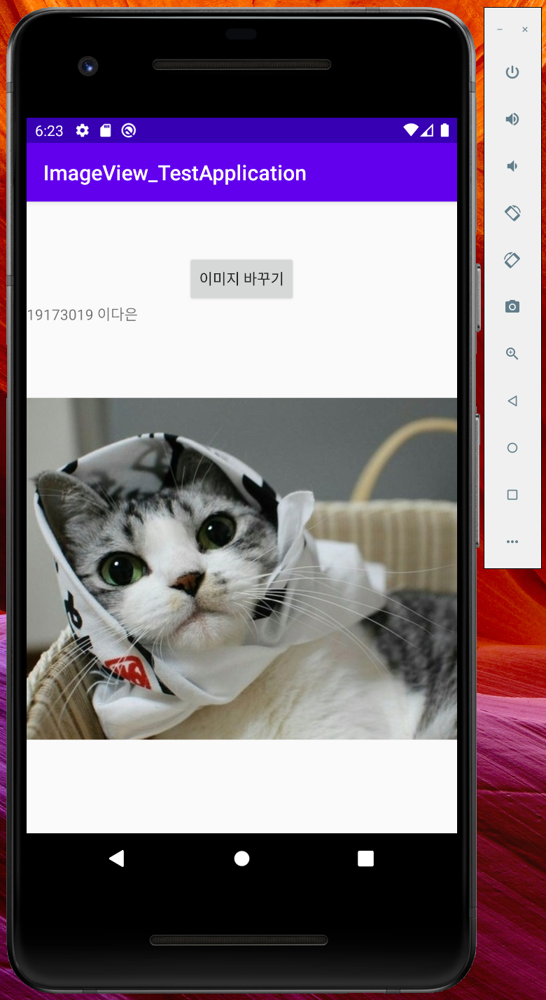
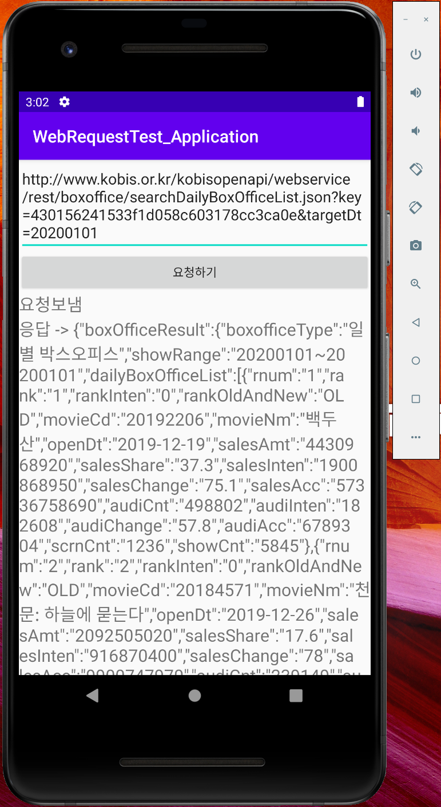

# MyFirstRepository

Hello My name is lee da eun

## 2주차 과제
</img>

## 3주차 과제 
</img>
</img>
</img>

## 4주차 과제
- 반려견의 성향에 따라 상품을 추천해주는 앱
: 일반적으로 다른 앱들은 많은 용품들을 복잡하게 배치해두어 반려동물을 처음 키우는 견주들이 상품을 구입할 때에 어려움을 겪게 됩니다. 저는 그러한 점들과 차이를 두어 견주가 초반에 앱을 가입할 때에 자신의 반려견의 성향이나 건강상태를 입력할 수 있는 칸을 만들고 매번 그에 맞는 상품을 추천하는 앱을 만들고자 합니다. 또한 성향과 건강상태가 바뀔 수도 있다는 점을 고려하여 언제든 정보 수정이 가능하도록 할것입니다. 

## 7주차 과제
</img>
</img>

## 9주차 과제
</img>
</img>
</img>
</img>

## 10주차 과제
</img>
</img>

## 11주차 과제
</img>
</img>
</img>
</img>

## 12주차 과제
</img>
